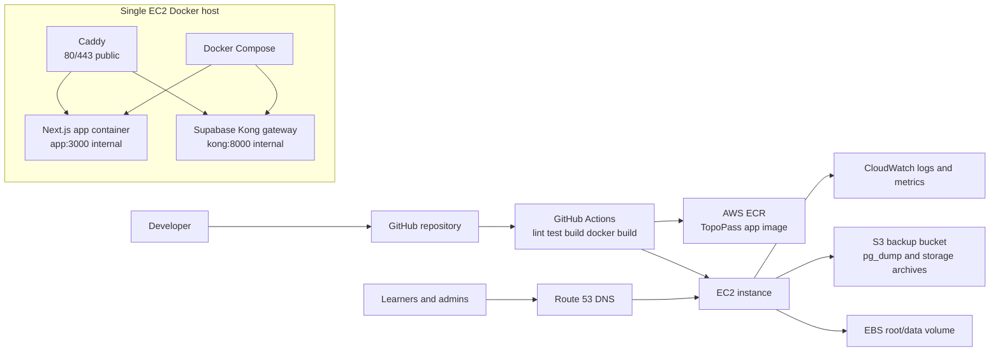

# AWS EC2 DevOps Deployment Plan

This document defines the Phase 4 low-cost deployment preparation for
TopoPass. It is documentation and deployable project scaffolding only. It does
not deploy AWS resources, add real production secrets, change product features,
or change learner/admin behaviour.

Current production direction:

- Next.js app runs in a Docker container.
- Supabase will be routed through a self-hosted Supabase gateway on the same
  Docker network when those containers are added.
- GitHub Actions will later build the Docker image and push it to AWS ECR.
- One EC2 instance will pull and run the app through Docker Compose.
- Caddy terminates TLS and reverse proxies to internal containers.
- Route 53 will point the production domain at the EC2 instance.
- CloudWatch will collect host/app logs and basic metrics.
- S3 stores logical Postgres backups and optional Supabase Storage archives.

Topographical Skills and SERU-style preparation remain separate product areas.
Signed-out local progress and signed-in Supabase progress must keep working.

## Target Architecture



## Why One EC2 Instance First

One EC2 instance is the right beta deployment target because it keeps cost,
debugging, and operational complexity low:

- It avoids ECS/Fargate load balancer and service overhead while traffic is
  small.
- Docker Compose is easy to inspect and recover during beta.
- Logical Postgres backups and restore drills are now part of the deployment
  plan before self-hosted Supabase goes live.
- The app can still use ECR, Route 53, IAM, and CloudWatch from day one.
- The deployment pattern can be migrated later without changing the product
  surface.

This is not the final scale architecture. It is the cheapest controlled
production path while the app validates usage and pricing.

## Future Migration Path

When traffic or reliability requirements increase:

- Move the app container from EC2 Docker Compose to ECS/Fargate.
- Add an Application Load Balancer, managed TLS, health checks, and rolling
  deployments.
- Keep ECR as the image registry.
- Keep Route 53 as the public DNS layer.
- Keep the same Supabase-facing application contract unless there is a specific
  reason to move database infrastructure later.
- Add CloudFront/WAF if caching, DDoS protection, or edge controls become
  necessary.
- Replace SSH deployment with SSM or fully managed GitHub Actions deployment
  through AWS roles.

## Required AWS Services

- **EC2:** one Linux host for Docker Compose.
- **ECR:** private image registry for the TopoPass Next.js image.
- **Route 53:** hosted zone and DNS records for the production domain.
- **CloudWatch:** logs, host metrics, alarms, and optional dashboards.
- **SNS:** optional email alerts for CloudWatch alarms.
- **IAM:** least-privilege permissions for image pulls, deployment, logs, and
  host operations.
- **EBS:** durable EC2 root volume and optional extra host data volume for
  Docker state/logs.
- **S3 backups:** logical Postgres dumps and optional storage archives.

## Brand-new AWS account setup before deployment

Complete these account-level steps before running `terraform apply` or starting
the GitHub Actions ECR publish workflow.

Account security:

- Enable MFA on the AWS root user.
- Configure alternate account contacts.
- Enable IAM access to billing if non-root users need billing visibility.
- Create an IAM admin user or admin role for day-to-day setup.
- Do not create or commit long-lived AWS access keys in this repository.

Region and CLI:

- Use `eu-west-2` as the default production region unless there is a specific
  deployment reason to change it.
- Configure AWS CLI credentials outside the repository.
- Verify local access with `aws sts get-caller-identity`.
- Verify the account ID before creating ECR, Route 53, or Terraform resources.

Budget alerts:

- Create or review account-level budget alerts before infrastructure is applied.
- Terraform also defines a monthly budget, SNS budget alerts, and an optional
  Lambda kill switch. AWS Budgets can notify late, so this is a safety net and
  not a hard spending cap.
- Keep `enable_budget_kill_switch = false` until SNS email confirmation and the
  Lambda path are tested.

GitHub OIDC role:

- Add the GitHub OIDC provider in AWS if it does not already exist.
- Create a role for `.github/workflows/docker-publish-ecr.yml`.
- Restrict the trust policy to the TopoPass repository and intended branch or
  workflow.
- Grant only the ECR permissions needed to authenticate and push image tags.
- Add these GitHub repository variables:
  - `AWS_REGION`
  - `AWS_ROLE_TO_ASSUME`
  - `ECR_REPOSITORY`
- Add optional build-time values only if needed:
  - `NEXT_PUBLIC_SITE_URL`
  - `NEXT_PUBLIC_SUPABASE_URL`
  - `NEXT_PUBLIC_SUPABASE_ANON_KEY` as a GitHub secret, never a service-role
    key.

ECR:

- Create the private ECR repository before running the image publish workflow.
- Confirm the repository name matches `ECR_REPOSITORY`.
- Confirm EC2 has instance-role permission to pull from ECR.

Secrets Manager and runtime secrets:

- Terraform creates the production runtime app env secret metadata when
  `enable_runtime_secrets_manager = true`.
- Terraform does not create a secret value or store dotenv content in state.
- The default secret name is `topopass/production/app-env`.
- The EC2 instance role can read only that runtime app env secret ARN.
- Enter or update the secret value manually in the AWS Console after Terraform
  creates the empty secret.
- `infra/deploy/fetch-runtime-env.sh` fetches the secret on EC2 and writes
  `/srv/topopass/env/app.env` without printing values.
- Additional secret names can be introduced later if needed:
  - `topopass/production/proxy-env`
  - `topopass/production/supabase-env`
  - `topopass/production/postgres-password`
  - `topopass/production/jwt-secret`
  - `topopass/production/backup-env`

Terraform backend and state:

- Decide the state backend before first apply.
- For shared or safer production use, create an S3 state bucket with encryption,
  versioning, public access block, and a DynamoDB lock table.
- If local state is used for an early single-operator beta, keep it outside Git
  and back it up securely.
- Do not put Supabase secrets, database passwords, JWT secrets, API keys, admin
  credentials, or `.env` content in Terraform variables, outputs, or state.

Domain and Route 53:

- Buy or transfer the domain.
- Create the Route 53 hosted zone.
- Point the registrar nameservers at Route 53.
- Wait for nameserver propagation.
- Set `domain_name`, and either `route53_zone_name` or `route53_zone_id`.
- Keep `enable_route53_records = false` until the hosted zone is verified.

EC2 access:

- Prefer SSM Session Manager for host access.
- Confirm the operator role can start an SSM session.
- Create an EC2 key pair only if temporary SSH is required.
- Keep `ssh_cidr_blocks = []` by default.
- If SSH is enabled temporarily, restrict it to the owner IP only.

Security group rules:

- Public ingress should be ports `80` and `443` only.
- SSH should remain disabled unless explicitly needed.
- Postgres must not be public.
- Supabase Studio must not be public.
- The app port `3000` must stay internal behind Caddy in production Compose.
- The Supabase gateway should be reached through Caddy over HTTPS, not by
  publishing internal Docker ports directly.

Backup plan:

- Review the Terraform S3 backup bucket and DLM snapshot settings.
- Confirm the backup retention window.
- Run one Postgres backup dry run after deployment.
- Run one real backup and verify it exists in S3.
- Complete a restore test before launch.

## Production Docker Support

This stage adds:

- `Dockerfile`
- `.dockerignore`
- `.env.production.example`
- `.env.docker.example`
- `docker-compose.yml`
- `deploy/docker-compose.prod.yml`

The Dockerfile builds the app using Next.js standalone output. The runtime image
does not install development dependencies and does not contain `.env` files.

Example local build command:

```bash
docker build -t topopass-web:local .
```

For production, GitHub Actions can later supply public build arguments:

```bash
docker build \
  --build-arg NEXT_PUBLIC_SITE_URL=https://example.com \
  --build-arg NEXT_PUBLIC_SUPABASE_URL=https://supabase.example.com \
  --build-arg NEXT_PUBLIC_SUPABASE_ANON_KEY=your-public-anon-key \
  -t "$ECR_IMAGE" .
```

`NEXT_PUBLIC_SUPABASE_ANON_KEY` is public browser configuration, not a
service-role key. RLS remains the security boundary for learner data.

## Docker Compose Template

`docker-compose.yml` runs only the app service for local and first EC2 app
runs:

- service name: `topopass-app`
- image name: `topopass-web:local`
- env file: `.env.docker`
- host mapping: `3000:3000`
- restart policy: `unless-stopped`
- health check against the local app

`deploy/docker-compose.prod.yml` is the stricter production-oriented template:

- Caddy is the only service publishing host ports `80` and `443`.
- Caddy loads `deploy/Caddyfile`.
- Caddy keeps persistent `caddy_data` and `caddy_config` volumes.
- App image defaults to
  `006419716542.dkr.ecr.eu-west-2.amazonaws.com/topopass-web:latest`, and can
  be overridden through `TOPOPASS_IMAGE`.
- App restart policy is `unless-stopped`.
- App env file is `/srv/topopass/env/app.env`.
- App exposes only internal Docker network port `3000`.
- App health check stays internal.
- Caddy health check validates the active Caddyfile.
- When the Supabase Postgres container is added, give it a local-only
  `pg_isready` health check. Do not publish Postgres publicly.

The self-hosted Supabase stack should join the same `topopass-prod` Docker
network and expose Kong internally as `kong:8000`. Postgres, Studio, Kong, and
the app must not publish direct public host ports.

## Domain, HTTPS, And Caddy

`deploy/Caddyfile` supports the current IP-only smoke test and future real
domain mode through runtime environment variables.

Current no-domain smoke test values:

```bash
APP_DOMAIN=:80
WWW_DOMAIN=http://www.topopass.invalid
SUPABASE_DOMAIN=http://supabase.topopass.invalid
ACME_EMAIL=admin@example.com
```

With `APP_DOMAIN=:80`, Caddy serves the app over plain HTTP on the EC2 public
IP. It does not request certificates for placeholder domains.

Future domain values:

```bash
APP_DOMAIN=example.com
WWW_DOMAIN=www.example.com
SUPABASE_DOMAIN=supabase.example.com
ACME_EMAIL=admin@example.com
```

Caddy handles automatic HTTPS, redirects `www` to the apex app domain, proxies
the app domain to `app:3000`, and prepares the Supabase domain proxy to
`kong:8000` for the later self-hosted Supabase stack. Supabase Studio is not
exposed publicly by default. If Studio access is needed, use SSM tunnelling or
add a separately protected option later.

The legacy `infra/caddy/Caddyfile` remains for historical reference, but the
production Compose stack uses `deploy/Caddyfile`.

`deploy/env/proxy.env.example` documents the expected reverse-proxy env shape.

## EC2 Compose Deployment

Connect using SSM:

```bash
aws ssm start-session --target <instance-id> --region eu-west-2
```

Copy or pull the repository onto the host under `/srv/topopass`. For example:

```bash
cd /srv
sudo git clone https://github.com/<owner>/<repo>.git topopass
sudo chown -R ubuntu:ubuntu /srv/topopass
```

If the repo is already present, pull the latest safe deployment commit:

```bash
cd /srv/topopass
git pull --ff-only
```

Create host env files from the examples without committing them:

```bash
sudo mkdir -p /srv/topopass/env /srv/topopass/logs/caddy /srv/topopass/logs/deploy
sudo cp /srv/topopass/deploy/env/proxy.env.example /srv/topopass/env/proxy.env
sudo nano /srv/topopass/env/proxy.env
```

For the first IP-only smoke test, keep `APP_DOMAIN=:80` in `proxy.env` and set
`NEXT_PUBLIC_SITE_URL=http://<EC2_PUBLIC_IP>` in `app.env`.

## Runtime Env From AWS Secrets Manager

Terraform creates only the Secrets Manager secret metadata. It does not create
or store a secret value. After Terraform apply:

1. Open AWS Secrets Manager in `eu-west-2`.
2. Open the secret named by the Terraform `runtime_secret_name` output.
3. Choose **Retrieve secret value** / **Edit**.
4. Paste plain dotenv text as the secret value.
5. Save the secret value without copying it into Git, Terraform variables,
   GitHub Actions logs, shell history, or documentation.

Example shape:

```dotenv
NEXT_PUBLIC_SITE_URL=http://YOUR_EC2_PUBLIC_IP
NEXT_PUBLIC_SUPABASE_URL=https://YOUR_PROJECT_REF.supabase.co
NEXT_PUBLIC_SUPABASE_ANON_KEY=your-public-anon-key
```

`NEXT_PUBLIC_*` values are browser-visible by design. They are safe only when
the backend enforces RLS and does not expose privileged keys.

Server-only values must not use the `NEXT_PUBLIC_` prefix. A Supabase
service-role key, if a future server-only workflow ever needs one, belongs only
in server-side runtime env and must never be exposed to browser bundles,
GitHub Actions logs, Terraform variables, Compose output, or commits.

Fetch the secret onto the EC2 host:

```bash
cd /srv/topopass
sudo bash infra/deploy/fetch-runtime-env.sh
sudo ls -l /srv/topopass/env/app.env
```

The fetch script:

- calls `aws secretsmanager get-secret-value` using the EC2 instance role
- writes `/srv/topopass/env/app.env`
- sets root ownership and `0600` permissions
- fails if the secret is missing, empty, or not dotenv-like
- does not print the secret value

Because `app.env` is root-readable only, run the production deploy script with
`sudo`:

Authenticate Docker to ECR using the EC2 instance role:

```bash
aws ecr get-login-password --region eu-west-2 \
  | docker login --username AWS --password-stdin 006419716542.dkr.ecr.eu-west-2.amazonaws.com
```

The deploy script performs that login automatically, pulls the latest ECR image,
validates Compose, restarts the stack, shows status, and runs a local Caddy
health check:

```bash
cd /srv/topopass
sudo bash infra/deploy/deploy-ec2-compose.sh
```

Manual equivalent:

```bash
cd /srv/topopass
export TOPOPASS_IMAGE=006419716542.dkr.ecr.eu-west-2.amazonaws.com/topopass-web:latest
export TOPOPASS_APP_ENV_FILE=/srv/topopass/env/app.env
export TOPOPASS_PROXY_ENV_FILE=/srv/topopass/env/proxy.env
sudo --preserve-env=TOPOPASS_IMAGE,TOPOPASS_APP_ENV_FILE,TOPOPASS_PROXY_ENV_FILE docker compose -f deploy/docker-compose.prod.yml config
sudo --preserve-env=TOPOPASS_IMAGE,TOPOPASS_APP_ENV_FILE,TOPOPASS_PROXY_ENV_FILE docker compose -f deploy/docker-compose.prod.yml pull
sudo --preserve-env=TOPOPASS_IMAGE,TOPOPASS_APP_ENV_FILE,TOPOPASS_PROXY_ENV_FILE docker compose -f deploy/docker-compose.prod.yml up -d --remove-orphans
sudo --preserve-env=TOPOPASS_IMAGE,TOPOPASS_APP_ENV_FILE,TOPOPASS_PROXY_ENV_FILE docker compose -f deploy/docker-compose.prod.yml ps
```

IP smoke tests:

```bash
curl -I http://127.0.0.1
curl -fsS http://127.0.0.1/api/health
curl -I http://<EC2_PUBLIC_IP>
```

Logs and operations:

```bash
docker compose -f deploy/docker-compose.prod.yml logs --tail 100 app
docker compose -f deploy/docker-compose.prod.yml logs --tail 100 caddy
docker compose -f deploy/docker-compose.prod.yml restart app
docker compose -f deploy/docker-compose.prod.yml restart caddy
docker compose -f deploy/docker-compose.prod.yml down
```

When DNS is ready, update `/srv/topopass/env/proxy.env` with real
`APP_DOMAIN`, `WWW_DOMAIN`, `SUPABASE_DOMAIN`, and `ACME_EMAIL` values, update
`NEXT_PUBLIC_SITE_URL` in the Secrets Manager runtime secret, rerun
`sudo bash infra/deploy/fetch-runtime-env.sh`, then rerun
`sudo bash infra/deploy/deploy-ec2-compose.sh`.

Do not commit `/srv/topopass/env/app.env`, `/srv/topopass/env/proxy.env`,
Terraform state, `terraform.tfvars`, AWS credentials, Docker output, logs,
`.next`, or `node_modules`.

Legacy notes from the earlier reverse-proxy stage used these runtime
environment variables:

- `APP_DOMAIN=example.com`
- `WWW_DOMAIN=www.example.com`
- `SUPABASE_DOMAIN=supabase.example.com`
- `ACME_EMAIL=admin@example.com`

HTTPS verification:

- `http://example.com` redirects to `https://example.com`.
- `https://example.com` loads the Next.js app.
- `https://www.example.com` redirects to `https://example.com`.
- `https://supabase.example.com` reaches the Supabase gateway.
- Browser console has no mixed-content errors.
- Public ports `3000`, `5432`, `8000`, Supabase Studio ports, and local
  Supabase dev ports are not exposed.
- Caddy logs show successful certificate issuance.
- Next.js auth and progress features use `https://supabase.example.com`.

## Secret Rules

- No real secrets in Git.
- No `.env`, `.env.local`, or `.env.production` committed.
- No secrets baked into Docker images.
- Runtime env files live only on EC2, for example
  `/srv/topopass/env/app.env`.
- GitHub Actions secrets are used only where required for ECR/AWS deployment.
- No Supabase service-role key in browser code.
- No service-role key in Docker build arguments.
- Do not print passwords, cookies, tokens, Supabase service keys, or raw learner
  data to logs.
- Do not upload raw `.env` files to S3. If an operational secret backup is ever
  required, encrypt it separately and document the restore path.
- Public Supabase URL and anon key can be visible to browsers, but all private
  data must remain protected by Supabase RLS and server-side role checks.

## EC2 Host Plan

Recommended host layout:

```text
/srv/topopass/
  deploy/docker-compose.prod.yml
  deploy/Caddyfile
  env/
    app.env
    proxy.env
  logs/
    caddy/
    deploy/
```

Recommended network exposure:

- Public: 80 and 443 only through Caddy.
- Temporary beta SSH: restricted to the owner IP only.
- Preferred later access: AWS Systems Manager Session Manager.
- App container: internal Docker network port 3000 only.
- Supabase gateway: internal Docker network port 8000 only.
- Postgres and Supabase Studio: no public host ports.
- Backup logs: `/var/log/topopass/backups/*.log`.
- Caddy logs: `/srv/topopass/logs/caddy/*.log`.

## Monitoring

Step 45 adds lean CloudWatch monitoring:

- `app/api/health/route.ts` returns a minimal JSON status for app health.
- Production Compose checks `http://127.0.0.1:3000/api/health`.
- Caddy validates its Caddyfile as a lightweight container health check.
- `infra/monitoring/cloudwatch-agent.json` collects disk, memory, CPU, swap,
  backup logs, Caddy logs, deploy logs, syslog, and user-data logs where paths
  exist.
- Terraform creates CloudWatch log groups with explicit retention to control
  cost.
- Terraform creates CloudWatch alarms for EC2 status check failure, high CPU,
  high memory, and high disk usage.
- Terraform creates an SNS alert topic and optional email subscription through
  `alert_email`.

## AWS Budget Kill Switch

Step 45 also adds an optional AWS Budget cost-protection kill switch. It is
disabled by default and should be enabled only after reviewing the behavior.

Terraform variables:

- `budget_limit_amount`: default `20`
- `budget_limit_unit`: default `USD`
- `budget_alert_email`: owner email for budget SNS alerts
- `enable_budget_kill_switch`: default `false`

Budget notifications:

- `50%` actual spend: email alert through the budget SNS topic.
- `80%` forecasted spend: email alert through the budget SNS topic.
- `100%` actual spend: SNS notification that can invoke the Lambda kill switch.

The Lambda only stops running EC2 instances tagged:

```text
Project = topopass
Environment = production
```

It must not delete EC2 instances, EBS volumes, snapshots, Route 53 records, ECR
repositories, or Secrets Manager entries. The IAM policy allows only
`ec2:DescribeInstances`, `ec2:StopInstances`, and Lambda log writes.

AWS Budgets can take time to evaluate and notify. This is not a hard real-time
spending cap. Keep billing alerts, cost reviews, and low-cost instance sizing in
place.

## Backups

Step 45 adds logical backup scripts under `infra/backups`.

Primary database backup:

```bash
BACKUP_ENV_FILE=/opt/topopass/.env.production /srv/topopass/infra/backups/backup-postgres.sh
```

Dry run:

```bash
BACKUP_ENV_FILE=/opt/topopass/.env.production /srv/topopass/infra/backups/backup-postgres.sh --dry-run
```

Verify latest backup:

```bash
BACKUP_ENV_FILE=/opt/topopass/.env.production /srv/topopass/infra/backups/verify-latest-backup.sh
```

Optional storage backup:

```bash
BACKUP_ENV_FILE=/opt/topopass/.env.production /srv/topopass/infra/backups/backup-storage.sh
```

Database backups do not restore deleted Supabase Storage objects. Use the
storage backup separately once Supabase Storage is mounted locally.

Enable the daily Postgres backup timer manually:

```bash
sudo cp /srv/topopass/infra/backups/systemd/topopass-postgres-backup.service /etc/systemd/system/
sudo cp /srv/topopass/infra/backups/systemd/topopass-postgres-backup.timer /etc/systemd/system/
sudo systemctl daemon-reload
sudo systemctl enable --now topopass-postgres-backup.timer
```

Restore documentation lives at `infra/backups/restore-postgres.md`.

EBS snapshots remain useful for host/volume recovery, but logical `pg_dump`
backups are the main database restore path.

## GitHub Actions Plan

Step 42 adds `.github/workflows/docker-publish-ecr.yml`. That workflow only
builds and publishes the app image to private ECR.

The workflow:

1. Runs on push to `main` and manual `workflow_dispatch`.
2. Checks out the repository.
3. Assumes an AWS IAM role through GitHub OIDC.
4. Logs in to Amazon ECR.
5. Builds the Docker image from the existing Dockerfile.
6. Tags the image with the Git commit SHA and `latest`.
7. Pushes both tags to the configured private ECR repository.

Required GitHub repository variables:

- `AWS_REGION`
- `AWS_ROLE_TO_ASSUME`
- `ECR_REPOSITORY`
- optional `NEXT_PUBLIC_SITE_URL`
- optional `NEXT_PUBLIC_SUPABASE_URL`

Optional GitHub repository secret:

- `NEXT_PUBLIC_SUPABASE_ANON_KEY`, only if the image build needs the managed
  Supabase anon key at build time.

The workflow does not deploy to EC2. A later deployment workflow should:

1. Pull the ECR image on EC2.
2. Run `docker compose up -d`.
3. Check app health.
4. Keep rollback instructions for the previous image tag.

## Phase 4 Manual Checklist

- [ ] Confirm `npm.cmd run lint` passes.
- [ ] Confirm `npm.cmd test` passes.
- [ ] Confirm `npm.cmd run build` passes.
- [ ] Confirm Docker is available locally or in CI.
- [ ] Build the Docker image without real secrets.
- [ ] Confirm `.env.production.example` contains placeholders only.
- [ ] Copy `.env.docker.example` to an untracked `.env.docker` for local
      Compose tests.
- [ ] Create production runtime env file directly on EC2.
- [ ] Confirm production Supabase auth redirect URLs use the HTTPS app domain.
- [ ] Confirm Supabase RLS still protects learner data.
- [ ] Push image to ECR from CI.
- [ ] Pull image from EC2.
- [ ] Run Docker Compose on EC2.
- [ ] Start Caddy reverse proxy.
- [ ] Open only ports 80 and 443 publicly.
- [ ] Restrict SSH to owner IP or replace with SSM.
- [ ] Configure Route 53 DNS.
- [ ] Configure CloudWatch logs and alarms.
- [ ] Confirm SNS email subscription if `alert_email` is set.
- [ ] Run a manual Postgres backup dry run.
- [ ] Run one real Postgres backup and verify it in S3.
- [ ] Enable the systemd timer after the backup succeeds.
- [ ] Run a restore drill before launch.
- [ ] Confirm signed-out local progress works after deployment.
- [ ] Confirm signed-in Supabase progress works after deployment.
- [ ] Confirm Topographical and SERU areas remain separate.

## Out Of Scope For This Stage

- Actual AWS deployment.
- GitHub Actions deployment workflow implementation.
- Self-hosted Supabase.
- Payment provider setup.
- Product feature or UI changes.
