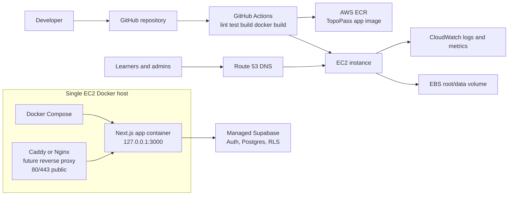

# AWS EC2 DevOps Deployment Plan

This document defines the Phase 4 low-cost deployment preparation for
TopoPass. It is documentation and deployable project scaffolding only. It does
not deploy AWS resources, add real production secrets, change product features,
or change learner/admin behaviour.

Current production direction:

- Next.js app runs in a Docker container.
- Supabase remains managed Supabase for now.
- GitHub Actions will later build the Docker image and push it to AWS ECR.
- One EC2 instance will pull and run the app through Docker Compose.
- Caddy or Nginx will later terminate TLS and reverse proxy to the app.
- Route 53 will point the production domain at the EC2 instance.
- CloudWatch will collect host/app logs and basic metrics.

Topographical Skills and SERU-style preparation remain separate product areas.
Signed-out local progress and signed-in Supabase progress must keep working.

## Target Architecture



## Why One EC2 Instance First

One EC2 instance is the right beta deployment target because it keeps cost,
debugging, and operational complexity low:

- It avoids ECS/Fargate load balancer and service overhead while traffic is
  small.
- Docker Compose is easy to inspect and recover during beta.
- Managed Supabase already handles database availability, backups, and RLS.
- The app can still use ECR, Route 53, IAM, and CloudWatch from day one.
- The deployment pattern can be migrated later without changing the product
  surface.

This is not the final scale architecture. It is the cheapest controlled
production path while the app validates usage and pricing.

## Future Migration Path

When traffic or reliability requirements increase:

- Move the app container from EC2 Docker Compose to ECS/Fargate.
- Add an Application Load Balancer, managed TLS, health checks, and rolling
  deployments.
- Keep ECR as the image registry.
- Keep Route 53 as the public DNS layer.
- Keep managed Supabase unless there is a specific reason to move database
  infrastructure.
- Add CloudFront/WAF if caching, DDoS protection, or edge controls become
  necessary.
- Replace SSH deployment with SSM or fully managed GitHub Actions deployment
  through AWS roles.

## Required AWS Services

- **EC2:** one Linux host for Docker Compose.
- **ECR:** private image registry for the TopoPass Next.js image.
- **Route 53:** hosted zone and DNS records for the production domain.
- **CloudWatch:** logs, host metrics, alarms, and optional dashboards.
- **IAM:** least-privilege permissions for image pulls, deployment, logs, and
  host operations.
- **EBS:** durable EC2 root volume and optional extra host data volume for
  Docker state/logs.
- **S3 backups if needed:** optional storage for deployment artifacts, exported
  app data, or additional backups. Managed Supabase remains responsible for
  primary database backups at this stage.

## Production Docker Support

This stage adds:

- `Dockerfile`
- `.dockerignore`
- `.env.production.example`
- `.env.docker.example`
- `docker-compose.yml`
- `deploy/docker-compose.prod.yml`

The Dockerfile builds the app using Next.js standalone output. The runtime image
does not install development dependencies and does not contain `.env` files.

Example local build command:

```bash
docker build -t topopass-web:local .
```

For production, GitHub Actions can later supply public build arguments:

```bash
docker build \
  --build-arg NEXT_PUBLIC_SITE_URL=https://topopass.co.uk \
  --build-arg NEXT_PUBLIC_SUPABASE_URL=https://your-project.supabase.co \
  --build-arg NEXT_PUBLIC_SUPABASE_ANON_KEY=your-public-anon-key \
  -t "$ECR_IMAGE" .
```

`NEXT_PUBLIC_SUPABASE_ANON_KEY` is public browser configuration, not a
service-role key. RLS remains the security boundary for learner data.

## Docker Compose Template

`docker-compose.yml` runs only the app service for local and first EC2 app
runs:

- service name: `topopass-app`
- image name: `topopass-web:local`
- env file: `.env.docker`
- host mapping: `3000:3000`
- restart policy: `unless-stopped`
- health check against the local app

`deploy/docker-compose.prod.yml` is the stricter production-oriented template:

- image supplied by `TOPOPASS_IMAGE`
- restart policy: `unless-stopped`
- env file: `/opt/topopass/env/app.env`
- app bound to `127.0.0.1:3000:3000`
- health check against the local app

For EC2, prefer the production-oriented template once Caddy or Nginx is added.
The app should not be published directly to the public internet after the
reverse proxy exists. A later Caddy or Nginx container should expose only ports
80 and 443 and proxy traffic to `127.0.0.1:3000`.

## Secret Rules

- No real secrets in Git.
- No `.env`, `.env.local`, or `.env.production` committed.
- No secrets baked into Docker images.
- Runtime env files live only on EC2, for example
  `/opt/topopass/env/app.env`.
- GitHub Actions secrets are used only where required for ECR/AWS deployment.
- No Supabase service-role key in browser code.
- No service-role key in Docker build arguments.
- Do not print passwords, cookies, tokens, Supabase service keys, or raw learner
  data to logs.
- Public Supabase URL and anon key can be visible to browsers, but all private
  data must remain protected by Supabase RLS and server-side role checks.

## EC2 Host Plan

Recommended host layout:

```text
/opt/topopass/
  compose.yml
  env/
    app.env
  releases/
  logs/
```

Recommended network exposure:

- Public: 80 and 443 only after reverse proxy is added.
- Temporary beta SSH: restricted to the owner IP only.
- Preferred later access: AWS Systems Manager Session Manager.
- App container: bound to localhost on port 3000.
- Supabase: managed external service, not self-hosted on EC2.

## GitHub Actions Plan

No workflow is added in this stage. The future workflow should:

1. Run lint, tests, and production build.
2. Build the Docker image.
3. Push to ECR.
4. Deploy to EC2 through SSH or SSM.
5. Pull the image on EC2.
6. Run `docker compose up -d`.
7. Check app health.
8. Keep rollback instructions for the previous image tag.

## Phase 4 Manual Checklist

- [ ] Confirm `npm.cmd run lint` passes.
- [ ] Confirm `npm.cmd test` passes.
- [ ] Confirm `npm.cmd run build` passes.
- [ ] Confirm Docker is available locally or in CI.
- [ ] Build the Docker image without real secrets.
- [ ] Confirm `.env.production.example` contains placeholders only.
- [ ] Copy `.env.docker.example` to an untracked `.env.docker` for local
      Compose tests.
- [ ] Create production runtime env file directly on EC2.
- [ ] Confirm managed Supabase project has correct auth redirect URLs.
- [ ] Confirm Supabase RLS still protects learner data.
- [ ] Push image to ECR from CI.
- [ ] Pull image from EC2.
- [ ] Run Docker Compose on EC2.
- [ ] Add Caddy or Nginx reverse proxy.
- [ ] Open only ports 80 and 443 publicly.
- [ ] Restrict SSH to owner IP or replace with SSM.
- [ ] Configure Route 53 DNS.
- [ ] Configure CloudWatch logs and alarms.
- [ ] Confirm signed-out local progress works after deployment.
- [ ] Confirm signed-in Supabase progress works after deployment.
- [ ] Confirm Topographical and SERU areas remain separate.

## Out Of Scope For This Stage

- Actual AWS deployment.
- GitHub Actions workflow implementation.
- Caddy or Nginx configuration.
- Terraform.
- Self-hosted Supabase.
- Payment provider setup.
- Product feature or UI changes.
