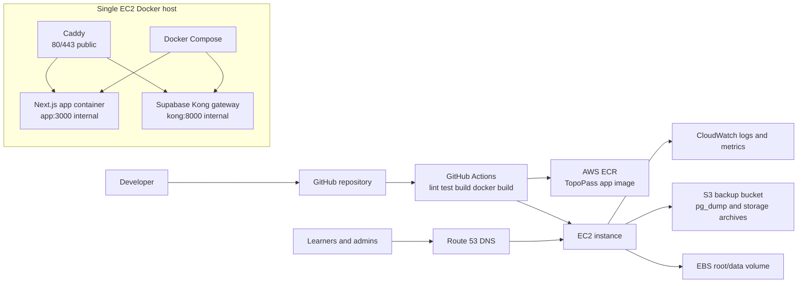

# AWS EC2 DevOps Deployment Plan

This document defines the Phase 4 low-cost deployment preparation for
TopoPass. It is documentation and deployable project scaffolding only. It does
not deploy AWS resources, add real production secrets, change product features,
or change learner/admin behaviour.

Current production direction:

- Next.js app runs in a Docker container.
- Supabase will be routed through a self-hosted Supabase gateway on the same
  Docker network when those containers are added.
- GitHub Actions will later build the Docker image and push it to AWS ECR.
- One EC2 instance will pull and run the app through Docker Compose.
- Caddy terminates TLS and reverse proxies to internal containers.
- Route 53 will point the production domain at the EC2 instance.
- CloudWatch will collect host/app logs and basic metrics.
- S3 stores logical Postgres backups and optional Supabase Storage archives.

Topographical Skills and SERU-style preparation remain separate product areas.
Signed-out local progress and signed-in Supabase progress must keep working.

## Target Architecture



## Why One EC2 Instance First

One EC2 instance is the right beta deployment target because it keeps cost,
debugging, and operational complexity low:

- It avoids ECS/Fargate load balancer and service overhead while traffic is
  small.
- Docker Compose is easy to inspect and recover during beta.
- Logical Postgres backups and restore drills are now part of the deployment
  plan before self-hosted Supabase goes live.
- The app can still use ECR, Route 53, IAM, and CloudWatch from day one.
- The deployment pattern can be migrated later without changing the product
  surface.

This is not the final scale architecture. It is the cheapest controlled
production path while the app validates usage and pricing.

## Future Migration Path

When traffic or reliability requirements increase:

- Move the app container from EC2 Docker Compose to ECS/Fargate.
- Add an Application Load Balancer, managed TLS, health checks, and rolling
  deployments.
- Keep ECR as the image registry.
- Keep Route 53 as the public DNS layer.
- Keep the same Supabase-facing application contract unless there is a specific
  reason to move database infrastructure later.
- Add CloudFront/WAF if caching, DDoS protection, or edge controls become
  necessary.
- Replace SSH deployment with SSM or fully managed GitHub Actions deployment
  through AWS roles.

## Required AWS Services

- **EC2:** one Linux host for Docker Compose.
- **ECR:** private image registry for the TopoPass Next.js image.
- **Route 53:** hosted zone and DNS records for the production domain.
- **CloudWatch:** logs, host metrics, alarms, and optional dashboards.
- **SNS:** optional email alerts for CloudWatch alarms.
- **IAM:** least-privilege permissions for image pulls, deployment, logs, and
  host operations.
- **EBS:** durable EC2 root volume and optional extra host data volume for
  Docker state/logs.
- **S3 backups:** logical Postgres dumps and optional storage archives.

## Production Docker Support

This stage adds:

- `Dockerfile`
- `.dockerignore`
- `.env.production.example`
- `.env.docker.example`
- `docker-compose.yml`
- `deploy/docker-compose.prod.yml`

The Dockerfile builds the app using Next.js standalone output. The runtime image
does not install development dependencies and does not contain `.env` files.

Example local build command:

```bash
docker build -t topopass-web:local .
```

For production, GitHub Actions can later supply public build arguments:

```bash
docker build \
  --build-arg NEXT_PUBLIC_SITE_URL=https://example.com \
  --build-arg NEXT_PUBLIC_SUPABASE_URL=https://supabase.example.com \
  --build-arg NEXT_PUBLIC_SUPABASE_ANON_KEY=your-public-anon-key \
  -t "$ECR_IMAGE" .
```

`NEXT_PUBLIC_SUPABASE_ANON_KEY` is public browser configuration, not a
service-role key. RLS remains the security boundary for learner data.

## Docker Compose Template

`docker-compose.yml` runs only the app service for local and first EC2 app
runs:

- service name: `topopass-app`
- image name: `topopass-web:local`
- env file: `.env.docker`
- host mapping: `3000:3000`
- restart policy: `unless-stopped`
- health check against the local app

`deploy/docker-compose.prod.yml` is the stricter production-oriented template:

- Caddy is the only service publishing host ports `80` and `443`.
- Caddy loads `infra/caddy/Caddyfile`.
- Caddy keeps persistent `caddy_data` and `caddy_config` volumes.
- App image is supplied by `TOPOPASS_IMAGE`.
- App restart policy is `unless-stopped`.
- App env file is `/opt/topopass/env/app.env`.
- App exposes only internal Docker network port `3000`.
- App health check stays internal.
- Caddy health check validates the active Caddyfile.
- When the Supabase Postgres container is added, give it a local-only
  `pg_isready` health check. Do not publish Postgres publicly.

The self-hosted Supabase stack should join the same `topopass-prod` Docker
network and expose Kong internally as `kong:8000`. Postgres, Studio, Kong, and
the app must not publish direct public host ports.

## Domain, HTTPS, And Caddy

`infra/caddy/Caddyfile` defines three public hostnames through runtime
environment variables:

- `APP_DOMAIN=example.com`
- `WWW_DOMAIN=www.example.com`
- `SUPABASE_DOMAIN=supabase.example.com`
- `ACME_EMAIL=admin@example.com`

Caddy handles automatic HTTPS, redirects `www` to the apex app domain, proxies
the app domain to `app:3000`, and proxies the Supabase domain to `kong:8000`.
Supabase Studio is not exposed publicly by default. If Studio access is needed,
use SSM/SSH tunnelling or add a separately protected option later.

Production env values should be created on the EC2 host only:

```bash
sudo mkdir -p /opt/topopass/env
sudo nano /opt/topopass/env/app.env
sudo nano /opt/topopass/env/proxy.env
```

Use the placeholders in `.env.production.example` as the shape, but never
commit the real files.

Production Compose checks:

```bash
export TOPOPASS_APP_ENV_FILE=/opt/topopass/env/app.env
export TOPOPASS_PROXY_ENV_FILE=/opt/topopass/env/proxy.env
docker compose -f deploy/docker-compose.prod.yml config
docker compose -f deploy/docker-compose.prod.yml up -d --build
docker compose -f deploy/docker-compose.prod.yml logs -f caddy
```

HTTPS verification:

- `http://example.com` redirects to `https://example.com`.
- `https://example.com` loads the Next.js app.
- `https://www.example.com` redirects to `https://example.com`.
- `https://supabase.example.com` reaches the Supabase gateway.
- Browser console has no mixed-content errors.
- Public ports `3000`, `5432`, `8000`, Supabase Studio ports, and local
  Supabase dev ports are not exposed.
- Caddy logs show successful certificate issuance.
- Next.js auth and progress features use `https://supabase.example.com`.

## Secret Rules

- No real secrets in Git.
- No `.env`, `.env.local`, or `.env.production` committed.
- No secrets baked into Docker images.
- Runtime env files live only on EC2, for example
  `/opt/topopass/env/app.env`.
- GitHub Actions secrets are used only where required for ECR/AWS deployment.
- No Supabase service-role key in browser code.
- No service-role key in Docker build arguments.
- Do not print passwords, cookies, tokens, Supabase service keys, or raw learner
  data to logs.
- Do not upload raw `.env` files to S3. If an operational secret backup is ever
  required, encrypt it separately and document the restore path.
- Public Supabase URL and anon key can be visible to browsers, but all private
  data must remain protected by Supabase RLS and server-side role checks.

## EC2 Host Plan

Recommended host layout:

```text
/opt/topopass/
  compose.yml
  env/
    app.env
  releases/
  logs/
```

Recommended network exposure:

- Public: 80 and 443 only through Caddy.
- Temporary beta SSH: restricted to the owner IP only.
- Preferred later access: AWS Systems Manager Session Manager.
- App container: internal Docker network port 3000 only.
- Supabase gateway: internal Docker network port 8000 only.
- Postgres and Supabase Studio: no public host ports.
- Backup logs: `/var/log/topopass/backups/*.log`.
- Caddy logs: `/srv/topopass/logs/caddy/*.log`.

## Monitoring

Step 45 adds lean CloudWatch monitoring:

- `app/api/health/route.ts` returns a minimal JSON status for app health.
- Production Compose checks `http://127.0.0.1:3000/api/health`.
- Caddy validates its Caddyfile as a lightweight container health check.
- `infra/monitoring/cloudwatch-agent.json` collects disk, memory, CPU, swap,
  backup logs, Caddy logs, deploy logs, syslog, and user-data logs where paths
  exist.
- Terraform creates CloudWatch log groups with explicit retention to control
  cost.
- Terraform creates CloudWatch alarms for EC2 status check failure, high CPU,
  high memory, and high disk usage.
- Terraform creates an SNS alert topic and optional email subscription through
  `alert_email`.

## Backups

Step 45 adds logical backup scripts under `infra/backups`.

Primary database backup:

```bash
BACKUP_ENV_FILE=/opt/topopass/.env.production /srv/topopass/infra/backups/backup-postgres.sh
```

Dry run:

```bash
BACKUP_ENV_FILE=/opt/topopass/.env.production /srv/topopass/infra/backups/backup-postgres.sh --dry-run
```

Verify latest backup:

```bash
BACKUP_ENV_FILE=/opt/topopass/.env.production /srv/topopass/infra/backups/verify-latest-backup.sh
```

Optional storage backup:

```bash
BACKUP_ENV_FILE=/opt/topopass/.env.production /srv/topopass/infra/backups/backup-storage.sh
```

Database backups do not restore deleted Supabase Storage objects. Use the
storage backup separately once Supabase Storage is mounted locally.

Enable the daily Postgres backup timer manually:

```bash
sudo cp /srv/topopass/infra/backups/systemd/topopass-postgres-backup.service /etc/systemd/system/
sudo cp /srv/topopass/infra/backups/systemd/topopass-postgres-backup.timer /etc/systemd/system/
sudo systemctl daemon-reload
sudo systemctl enable --now topopass-postgres-backup.timer
```

Restore documentation lives at `infra/backups/restore-postgres.md`.

EBS snapshots remain useful for host/volume recovery, but logical `pg_dump`
backups are the main database restore path.

## GitHub Actions Plan

Step 42 adds `.github/workflows/docker-publish-ecr.yml`. That workflow only
builds and publishes the app image to private ECR.

The workflow:

1. Runs on push to `main` and manual `workflow_dispatch`.
2. Checks out the repository.
3. Assumes an AWS IAM role through GitHub OIDC.
4. Logs in to Amazon ECR.
5. Builds the Docker image from the existing Dockerfile.
6. Tags the image with the Git commit SHA and `latest`.
7. Pushes both tags to the configured private ECR repository.

Required GitHub repository variables:

- `AWS_REGION`
- `AWS_ROLE_TO_ASSUME`
- `ECR_REPOSITORY`
- optional `NEXT_PUBLIC_SITE_URL`
- optional `NEXT_PUBLIC_SUPABASE_URL`

Optional GitHub repository secret:

- `NEXT_PUBLIC_SUPABASE_ANON_KEY`, only if the image build needs the managed
  Supabase anon key at build time.

The workflow does not deploy to EC2. A later deployment workflow should:

1. Pull the ECR image on EC2.
2. Run `docker compose up -d`.
3. Check app health.
4. Keep rollback instructions for the previous image tag.

## Phase 4 Manual Checklist

- [ ] Confirm `npm.cmd run lint` passes.
- [ ] Confirm `npm.cmd test` passes.
- [ ] Confirm `npm.cmd run build` passes.
- [ ] Confirm Docker is available locally or in CI.
- [ ] Build the Docker image without real secrets.
- [ ] Confirm `.env.production.example` contains placeholders only.
- [ ] Copy `.env.docker.example` to an untracked `.env.docker` for local
      Compose tests.
- [ ] Create production runtime env file directly on EC2.
- [ ] Confirm production Supabase auth redirect URLs use the HTTPS app domain.
- [ ] Confirm Supabase RLS still protects learner data.
- [ ] Push image to ECR from CI.
- [ ] Pull image from EC2.
- [ ] Run Docker Compose on EC2.
- [ ] Start Caddy reverse proxy.
- [ ] Open only ports 80 and 443 publicly.
- [ ] Restrict SSH to owner IP or replace with SSM.
- [ ] Configure Route 53 DNS.
- [ ] Configure CloudWatch logs and alarms.
- [ ] Confirm SNS email subscription if `alert_email` is set.
- [ ] Run a manual Postgres backup dry run.
- [ ] Run one real Postgres backup and verify it in S3.
- [ ] Enable the systemd timer after the backup succeeds.
- [ ] Run a restore drill before launch.
- [ ] Confirm signed-out local progress works after deployment.
- [ ] Confirm signed-in Supabase progress works after deployment.
- [ ] Confirm Topographical and SERU areas remain separate.

## Out Of Scope For This Stage

- Actual AWS deployment.
- GitHub Actions deployment workflow implementation.
- Self-hosted Supabase.
- Payment provider setup.
- Product feature or UI changes.
