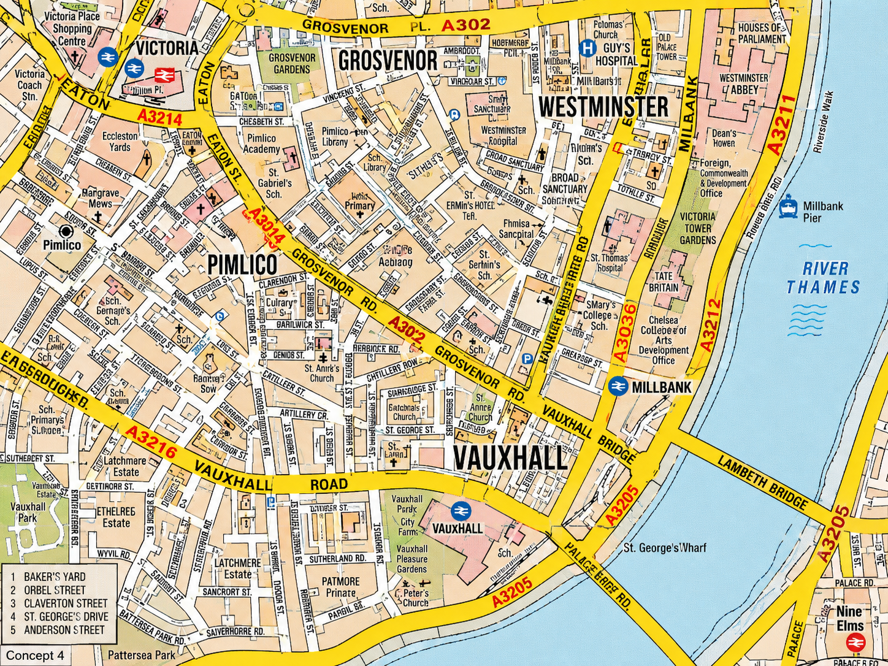

# Phase 8 Cartography Acceptance

The image below is the controlling Phase 8 visual master:

It controls the intended cartographic family for Phase 8: a dense, printed
London examination-atlas map with hard-edged hierarchy and compact information
density. It does not control production geography.

## Required Visual Character

- Broad continuous flat-yellow major-road corridors.
- Crisp dark road edges and a strong road hierarchy.
- Compact major-road names integrated into the road corridors.
- Prominent real A-road and B-road references where permitted source data
  provides them.
- Dense local-road presentation in built-up London areas.
- Compact labels on many useful streets.
- Large condensed district, neighbourhood, or area names where real source data
  supports them.
- Cream or warm built-up fabric.
- Visible building footprints or simplified blocks where permitted source data
  supports them.
- Muted pink institutional and landmark areas.
- Green parks and gardens.
- Pale-blue water.
- Visible rail and station context.
- Compact transport and public-feature symbols.
- Hard edges and flat printed-map composition.
- Minimal unexplained empty space in dense London areas.
- Dense but organised examination difficulty.

## Unacceptable Outcomes

- Google Maps-style appearance.
- Mapbox-style consumer presentation.
- Sparse minor-road coverage.
- Oversized street labels.
- Excessive blank background.
- Aggressive consumer-map decluttering.
- Weak major-road hierarchy.
- Large floating navigation icons.
- Route-first presentation that hides geography.
- Only active-route roads being shown.
- Turn-by-turn guidance during an independent attempt.
- Declaring completion because tests pass without visual evidence.

## Accuracy Rule

The approved visual master controls appearance only. Production geography must
come from permitted attributed data. Do not fabricate roads, road names, road
references, turn restrictions, building footprints, institutions, stations,
estates, neighbourhoods, landmarks, public facilities, parks, gardens, piers, or
water features from the concept image.

Where OpenStreetMap-derived data is rendered, TOPOPASS must keep OSM
attribution visible.

## Completion Gate

Phase 8 visual completion requires representative production screenshots from
the Real London renderer. Those screenshots must visibly belong to the same
cartographic family as the approved visual master while remaining an original
TOPOPASS implementation based only on permitted and attributed geography.

Passing lint, unit tests, build, or fixture metadata checks is not enough
without screenshot evidence and side-by-side visual review.
