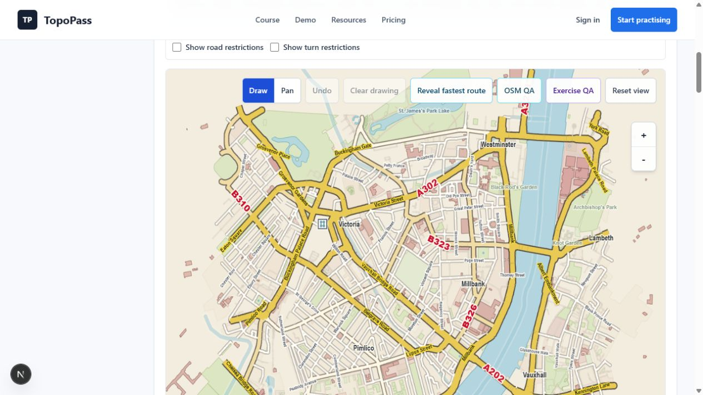
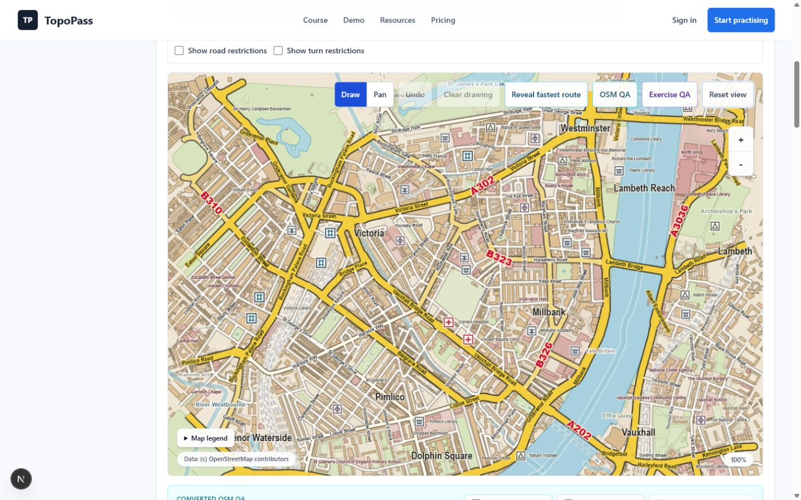

# Stage 8.8.1: Principal-Scale Near-Master Visual Correction

## Status

Implementation, production-renderer visual iteration and final visual
acceptance are complete. Stage 8.9 remains paused. Its uncommitted overlay work is preserved in
`stash@{0}`, named `WIP Stage 8.9 overlay rebalance before Stage 8.8.1`.

## Why Stage 8.8 Failed

The committed Stage 8.8 correction had accurate source-backed geography and
the right broad hierarchy, but its displayed-100% production view remained too
wide, pale and sparse at normal size. The rejected benchmark is:

`screenshots/stage-8-8/desktop-victoria-westminster-vauxhall-100-density-correction.png`

Compared with the approved visual master, it exposed too much surrounding
geography, suppressed most contextual labels and compact symbols, drew only a
small fraction of available building fabric, and left minor labels too pale to
scan. The previous Stage 8.8 acceptance statement is superseded by this
corrective record.

## Preflight

- Branch: `main`.
- Initial HEAD: `abdb631b0afbfcf8187964c21d0f9c6b76ea535c` (`Correct Phase 8 Stage 8.8 atlas density`).
- The approved visual master and committed Stage 8.8 screenshots were present
  and inspected at normal displayed size.
- The repository roadmap still assigns Stage 8.9 to learner-route, marker,
  hint and review-overlay rebalance.
- Stage 8.9 had three uncommitted paths. With explicit authorisation, only
  those paths were stored in the named stash before Stage 8.8.1 work began.
- The stash contains 3 files with 91 insertions and 173 deletions. It has not
  been applied, popped, modified or dropped.

## Root-Cause Diagnostics

The lightweight Victoria source was not the cause of the remaining sparse
result. The raw and adapted pipeline contained substantial usable detail:

| Pipeline level | Relevant coverage |
| --- | ---: |
| Raw unique elements | 63,469 |
| Raw nodes / ways | 47,488 / 15,954 |
| Raw named-road ways | 2,495 |
| Raw building ways | 5,688 |
| Raw contextual features | 2,593 |
| Adapted primary / secondary / tertiary roads | 2,176 / 389 / 243 |
| Adapted residential / service roads | 3,323 / 2,783 |
| Adapted road-name / road-reference candidates | 6,187 / 939 |
| Adapted building polygons | 5,675 |
| Adapted compact-symbol candidates | 336 |

The rejected production canvas used a wider reset extent and scale gates that
suppressed context at displayed 100%. It showed about 189 building polygons,
74 labels, 54 road names, 6 references and 2 compact symbols. The corrected
1120 by 760 internal principal canvas shows:

| Displayed coverage | Corrected count |
| --- | ---: |
| Visible building polygons | 4,094 |
| Institutional / land-use polygons | 190 / 205 |
| Open-space / park / pedestrian / water polygons | 137 / 128 / 60 / 17 |
| Placed labels | 149 |
| Placed road names / unique road names | 85 / 70 |
| Placed road references | 6 |
| District / contextual labels | 9 / 47 |
| Placed compact symbols | 26 |

At principal scale there are no road-scale or context-scale rejections.
Remaining deterministic rejection totals are dominated by collision (2,504),
road repeat distance (1,769), road text fit (962), viewport edge safety (1,234)
and short road geometry (185). These are expected organised-density controls,
not broad category suppression.

The reusable `map:audit:stage8-density` command reports raw, adapted,
viewport-visible and placed counts at displayed 80%, 100% and 125%, plus the
production desktop and phone canvas sizes and placement rejection reasons.

## Implementation

- The Victoria principal reset extent is reduced deterministically through a
  typed `principalResetExtentFactor`. Pan, zoom, reset and coordinate transforms
  continue through the existing viewport pipeline.
- Road hierarchy tokens now use flatter yellow fills, crisper dark casings and
  tighter but preserved primary-through-service width relationships.
- Road names use darker compact type, lower geometry gates, reduced repeat
  distances and tighter collision padding.
- District and contextual labels have stronger contrast and lower principal
  scale gates while remaining subordinate to learner overlays.
- Building and institutional fills admit complete small source polygons at the
  principal scale and use stronger warm fabric contrast.
- Compact source-backed symbols use lower principal gates and bounded desktop
  and phone budgets.
- Label placement exposes deterministic accept/reject diagnostics without
  adding learner-facing metadata.
- Focused regressions use the real 1120 by 760 production canvas and the
  existing tablet/phone viewport rules rather than a fictitious large canvas.

No Victoria-specific visible feature, road, building, label or symbol was
hard-coded.

## Visual Iterations

### Iteration 1

Evidence: `screenshots/stage-8-8-1/desktop-victoria-100-iteration-1.png`

Largest visible gaps were the wide principal extent, scale-suppressed building
fabric and near-absent context symbols. The reset extent and principal semantic
gates were corrected.

### Iteration 2

Evidence: `screenshots/stage-8-8-1/desktop-victoria-100-iteration-2.png`

The built field became continuous, but local names remained soft, major-road
edges remained comparatively smooth, and contextual hierarchy lacked weight.
Road, label, building and context contrast were tightened.

### Iteration 3

Evidence: `screenshots/stage-8-8-1/desktop-victoria-100-iteration-3-final.png`

Normal-size inspection found the largest correctable gaps materially reduced:
local names occupy built areas, warm building texture is continuous, compact
symbols recur where sourced, and flat yellow corridors with dark edges remain
authoritative. The final production principal capture is:

`screenshots/stage-8-8-1/desktop-victoria-westminster-vauxhall-100.png`

## Screenshot Index

All images are unedited production-renderer captures with source attribution
visible where the map is shown.

| Scenario | Viewport/state | Screenshot |
| --- | --- | --- |
| Victoria principal | desktop, displayed 100% | `screenshots/stage-8-8-1/desktop-victoria-westminster-vauxhall-100.png` |
| Victoria lower scale | desktop, displayed 80% | `screenshots/stage-8-8-1/desktop-victoria-westminster-vauxhall-80.png` |
| Victoria higher scale | desktop, displayed 125% | `screenshots/stage-8-8-1/desktop-victoria-westminster-vauxhall-125.png` |
| King's Cross / Euston | desktop, displayed 100% | `screenshots/stage-8-8-1/desktop-kings-cross-euston-100.png` |
| Piccadilly | desktop, displayed 100% | `screenshots/stage-8-8-1/desktop-piccadilly-100.png` |
| Waterloo | desktop, displayed 100% | `screenshots/stage-8-8-1/desktop-waterloo-100.png` |
| Quiet residential | desktop, displayed 100% | `screenshots/stage-8-8-1/desktop-quiet-residential-100.png` |
| One-way / restrictions | desktop, displayed 100% | `screenshots/stage-8-8-1/desktop-one-way-restrictions-100.png` |
| Active route | desktop, displayed 100% | `screenshots/stage-8-8-1/desktop-active-learner-route-100.png` |
| Passing review | desktop, submitted 100% pass | `screenshots/stage-8-8-1/desktop-correct-review-100.png` |
| Incorrect review | desktop, failed required destination | `screenshots/stage-8-8-1/desktop-incorrect-review-100.png` |
| Victoria principal | tablet, displayed 100% | `screenshots/stage-8-8-1/tablet-victoria-westminster-vauxhall-100.png` |
| Active route | tablet, displayed 100% | `screenshots/stage-8-8-1/tablet-active-learner-route-100.png` |
| Victoria principal | mobile, displayed 100% | `screenshots/stage-8-8-1/mobile-victoria-westminster-vauxhall-100.png` |
| Active route | mobile, displayed 100% | `screenshots/stage-8-8-1/mobile-active-learner-route-100.png` |
| Passing review | mobile 390 by 844, submitted 100% pass | `screenshots/stage-8-8-1/mobile-correct-review-100.png` |
| Incorrect review | mobile, expanded needs-review details | `screenshots/stage-8-8-1/mobile-incorrect-review-100.png` |

The mobile passing review was captured from the production learner surface by
submitting the engine-computed legal King's Cross / Euston station-corridor
route through normal canvas pointer handling, then resizing the same live page
to 390 by 844. Normal-size inspection confirms a submitted 100% pass, 2.21 km
learner route, 2.21 km shortest legal route, +0 m extra distance, responsive
review details and aligned map/route context. Scoring, snapping and route code
were not changed to obtain the evidence.

## Side-By-Side Finding

| Approved master | Rejected Stage 8.8 | Corrected Stage 8.8.1 |
| --- | --- | --- |
|  |  |  |

At normal size, the corrected Victoria image is dramatically closer to the
approved master than the rejected Stage 8.8 image. It now reads as a dense
printed examination-atlas field: local streets and labels occupy built areas,
building fabric is continuous, compact context marks recur, district names are
authoritative but subordinate, and major roads retain flat yellow fills, dark
edges and prominent genuine red references.

## Remaining Differences

| Difference from the visual master | Correctable? | Accounting |
| --- | --- | --- |
| The production viewport covers the required Victoria, Pimlico, Westminster, Millbank, Vauxhall and Thames geography rather than the master's generated crop. | No without failing geography requirements. | Accurate source-backed geography controls production framing. |
| The master's hand-authored shorthand, symbol shapes and typography are denser in places. | Not by direct imitation. | TOPOPASS retains original fonts, compact symbols and placement rules. |
| Piccadilly, one-way and quiet-residential fixtures contain visibly less building fabric than Victoria. | Only with additional verified source data. | Missing polygons are not fabricated and large replacement exports are not restored. |
| Canvas antialiasing is smoother than the printed/scanned reference. | Partly, but not usefully. | Artificial print damage would reduce clarity and does not improve the examination task. |
| The development-only mobile QA toolbar can overflow the narrow viewport. | Yes, in Stage 8.10. | Stage 8.10 owns responsive and accessibility layout; map geometry and labels remain aligned. |

Parks, water and genuinely sparse source areas remain open by design; they are
not collision-created blank fields.

## Non-Regressions And Deliberate Non-Changes

Route generation, exercise definitions, legality, restrictions, matching,
snapping, scoring, feedback, persistence, learner progress, authentication,
payments and deployment did not change. Learner/review overlay ownership and
draw order did not change. The Victoria fixture remains development-only,
unscoreable, lazy-loaded and absent from `/beta`. OSM attribution remains
visible. Stage 8.9 and Stage 8.10 were not started or continued.

## Performance And Validation

The corrected principal view remains within the existing viewport and symbol
budgets. Lazy fixture loading and beta exclusion are unchanged. Normal browser
interaction remained responsive while rendering the dense Victoria fixture,
switching scales and drawing the 230-node King's Cross legal route. Existing
performance-budget regressions remain green.

Final validation on the completed working tree:

- `npm.cmd run lint`: passed.
- `npm.cmd run test:map`: 1,219 passed; 0 failed, skipped, cancelled or todo.
- `npm.cmd test`: passed all eight chained suites, 1,573 tests in total; 0
  failed or skipped.
- `npm.cmd run build`: passed, including compilation, type checking and 70
  generated static pages.
- `git diff --check`: passed; only Git's existing LF-to-CRLF working-copy
  notices were emitted.
- The focused Stage 8.8.1 production-canvas renderer selection and responsive
  density regressions passed within `test:map`.

## Acceptance

Normal-size side-by-side inspection confirms that the final Victoria view is a
dramatic improvement over the rejected Stage 8.8 image and is the closest
permitted original TOPOPASS equivalent of the approved master for the available
source geography. Required desktop, tablet and mobile scenarios, including
passing and incorrect submitted reviews, have been inspected. Stage 8.8.1 is
accepted without modifying the preserved Stage 8.9 stash.
